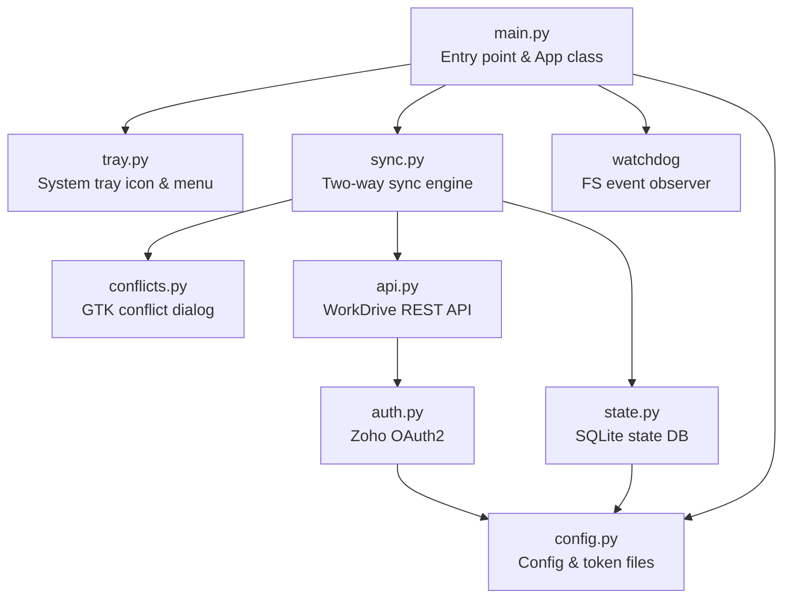
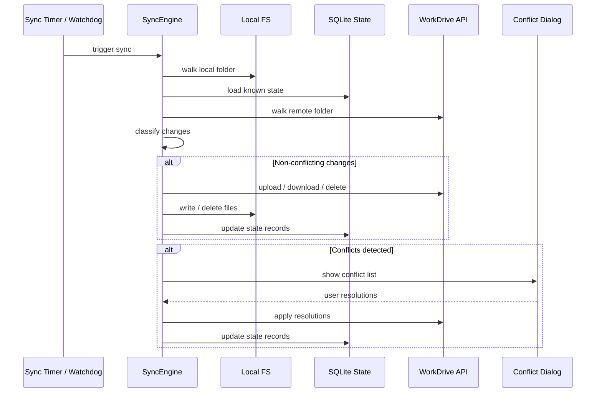
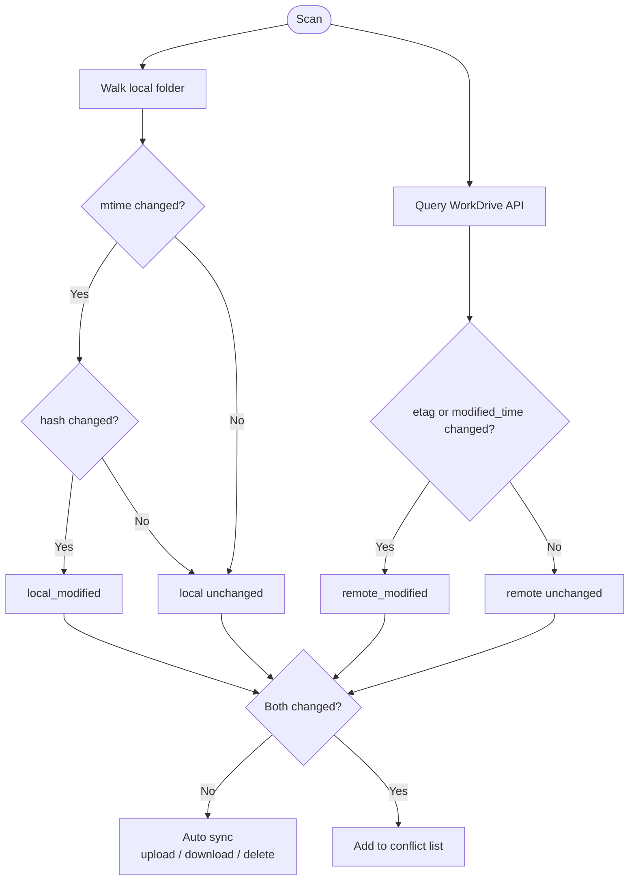

# Architecture

## Overview

workdrive-sync is a two-way file sync client between a local folder and a Zoho WorkDrive folder. It runs as a GNOME system tray application.

## Module Diagram



## Sync Cycle



## Delta Detection

Each file is tracked with both local (mtime + SHA-256 hash) and remote (etag + modified_time) state. On each sync cycle:



## Conflict Resolution

| Local | Remote | Conflict Type |
|-------|--------|---------------|
| modified | modified | Both modified |
| added | added | Both added |
| modified | deleted | Modified locally, deleted remotely |
| deleted | modified | Deleted locally, modified remotely |

User resolves each conflict via a batched GTK dialog with options:
- **Keep Local** -- upload local version (or delete remote if local was deleted)
- **Keep Remote** -- download remote version (or delete local if remote was deleted)
- **Keep Both** -- rename local to `file (conflict).ext`, download remote
- **Skip** -- do nothing this cycle

## File Layout

```
~/.config/workdrive-sync/
    config.json      # client_id, client_secret, folder paths, team_id
    token.json       # OAuth refresh token (chmod 600)
    state.db         # SQLite sync state (per-file hashes, etags)
```

## Threading Model

```
GTK Main Thread          Background Sync Thread       Watchdog Thread
      |                         |                          |
      |--- tray menu events     |                          |
      |--- conflict dialog      |                          |
      |                         |--- periodic sync         |
      |                         |    (every N seconds)     |
      |                         |                          |--- FS events
      |                         |<-- debounced trigger ----|
      |<-- GLib.idle_add -------|                          |
      |    (conflict dialog)    |                          |
```

- **GTK main thread**: runs the event loop, handles tray clicks and conflict dialogs
- **Sync thread**: periodic sync loop, also triggered by watchdog or manual "Sync Now"
- **Watchdog thread**: monitors local folder for changes, debounces (5s) before triggering sync
